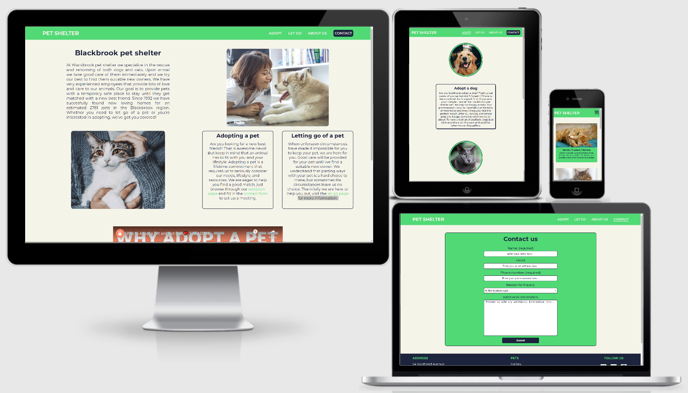
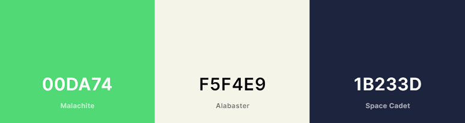

# Pet shelter

View live version of the website [here](https://larkinz.github.io/pet-shelter-project/).

Milestone Project 1: User-Centric Front-end Development – [Code Institute](https://codeinstitute.net/)

This website was made as my first milestone project for the Code Institute course. The website was created for a fictional pet shelter and the project requirements were to create a static front-end website using HTML and CSS.

---

## Contents

- [**User Experience Design (UXD)**](#user-experience-design-uxd)

  - [Strategy](#strategy)
    - Goal
    - User stories
  - [Scope](#scope)
    - Functional specifications
    - Content requirements
  - [Structure](#structure)
    - Information architecture
    - Interaction design
  - [Skeleton](#skeleton)
    - Wireframes
  - [Surface](#surface)
    - Colours
    - Typography
    - Uniformity

- [**Features**](#features)

  - Existing features
  - Future features

- [**Technologies**](#technologies)

  - Languages
  - Frameworks
  - Libraries
  - Software

- [**Testing**](#testing)

- [**Deployment**](#deployment)

  - Hosting online
  - Running locally

- [**Credits**](#credits)

  - Code
  - Text
  - Media
  - Miscellaneous
  - Acknowledgements

- [**Notes**](#notes)

---

## User experience design (UXD)

### Strategy

#### Goal

The goals for the (fictional) website owner would be to raise more awareness of their existence, get more people to know that they exist. This would result in more clients and therefore possibly more income. Another goal that this website would accomplish is better and more efficient contact between them and their clients.

The goal in regards to users is to provide them a website to allow for easy access to information, provide clear and simple contact details and show an overview of all pets that are available for adoption.

#### User stories

- As a **visitor**, I would like **to see an overview of all pets that are available for adoption**, so that **I don't have to travel there to find out if there is anything available that I'm looking for**.

- As a **visitor**, I would like **to see images of all pets that are available for adoption**, so that **I can decide if it's worth visiting the shelter**.

- As a **visitor**, I would like **an easy to fill in contact form**, so that **I can contact the pet shelter to get answers to any questions that I have**.

- As a **visitor**, I would like **to know the pet shelters' address information**, so that **I know where to travel to**.

- As a **visitor**, I would like **clear and concise information about letting go of a pet**, so that **I can get a good understanding of what the process is like**.

- As a **site owner**, I would like our website **to have an intuitive navigation system**, so that **visitors can easily access all available information**.

- As a **site owner**, I would like our website **to have a contact form where clients can specify their needs**, so that **we prevent unnecessary customer support calls**.

### Scope

#### Functional specifications

The website should have a navigation bar. When the user clicks on the logo it should go back to the homepage. Content on the website should support different screensizes. Wherever appropriate and or possible, visible indicators should be shown to users when they can perform an action on the website (like clicking a link or a button).

#### Content requirements

The website needs to provide information about: the pet shelter, the process of adopting a pet and the process of letting go of a pet. The website needs to provide address and contact information. The website needs a seperate contact form where clients can specify their needs. The website needs a page that shows all pets that are available for adoption.

### Structure

#### Information architecture

The website uses what I would call a 'spider web structure', where every page is always just one click away. Most pages are accessible through the navigation bar at the top of the website, while some adoption sub-category pages are accessible in the footer on the bottom of the website. I tried making a diagram of the structure, but it ended up looking pretty horrible. If you'd like to see it click [here](wireframes/structure-tree.png).

#### Interaction design

Users can use the clickable elements in the navigation bar to browse through the website. Some visible indicators will tell the user at which page they currently are, while other visible indicators will alert users when they are hovering a link. Users with touchscreens can swipe up and down to scroll through the web pages and they can (double)tap to open links and browse through the website. The embedded YouTube video on the frontpage can be started with a single tap or click, audio control is integrated in the YouTube player, so users can mute the audio or change the volume in there.

### Skeleton

The shape of the website will be pretty standard: a navigation bar at the top, the main content in the middle and a footer with some address info, extra navigation links and social media links at the bottom. The users will be able to get around the website by using the navigation bar, which will also have a clickable logo to go back to the frontpage. Users will also be able to use some more direct links in the footer to pages that are not presented in the navigation bar (for instance: sub categories for pet adoption). Most of the content will be presented in a grid-style layout. On smaller screensizes the layout will transform to a smaller number of columns to ensure readability and prevent deformations.

#### Wireframes

To see the wireframes in PDF click [here](wireframes/pet-shelter-wireframes.pdf). (download and zoom out for best view)

### Surface

#### Colours

My plan was to use green, beige/off-white and dark blue/black colours for the website. I tried several different variations and settled on the ones shown in the image below. The contrast between them is pretty great, which ensures that everything is clearly readable.

#### Typography

I'm currently using the font-style 'Montserrat' from the Google Fonts library throughout the website. It just looks very clean and readable in my opinion.

#### Uniformity

To keep the website looking uniform I'm trying to making sure that all related contents throughout the website are consistent in font size and styling. The positioning of elements should be consistent in height, padding and spacing. I'm also using either grid, flexbox or both to present the content in a logical order.

**_[Back to top](#contents)_**

---

## Features

### Existing features

#### General features

**Navigation bar**:
Every page will have a navigation bar that will always stay visible at the top of the screen. The navigation bar has a clickable logo on the left side that returns the user to the homepage. On the right side it has internal links to the adoption page, letting go page, about us page and the contact page. It will be fully responsive in the sense that it will shrink on smaller screen sizes and eventually collapse into a so called hamburger menu.

**Footer**:
Every page will have a footer that is visible when the user is at the bottom of the page. On the left side it contains address information and a phone number. In the middle it has internal links to pages related to pets, most important are the direct links related to adopting a pet, since they take the user directly to them instead of having to go through the general adoption page. On the right side are social media icons that could have taken visitors to the external social media platforms if this wasn't a fictional project. The footer will be fully responsive, depending on the users' screen size, content will change from a horizontal to a vertical alignment.

#### Page specific features

**Homepage**:
The homepage provides the visitor with some general information about the pet shelter. It also includes some introductory information regarding both pet adoption and letting go of a pet as well as directions to their respective pages. Some images of pets are shown to engage the visitor. Below the main part of the homepage there is a section showing a video about why to adopt a pet to engage the visitor.

**Adoption page**:
The adoption page has images of different types of pets and below them are corresponding cards with information. The cards have an animation effect when hovered with the mouse and they are clickable, when clicked the visitor is taken to the corresponding pet adoption page.

**Dog gallery page**:
The dog gallery page provides the visitor with an overview of all dogs available for adoption. Each dog has a card that contains a photo, information and a short description of the pet.

**Cat gallery page**:
The cat gallery page provides the visitor with an overview of all cats available for adoption. Each cat has a card that contains a photo, information and a short description of the pet.

**All pets gallery page**:
The all pets gallery page provides the visitor with an overview of all pets available for adoption, so both cats and dogs in one overview. Each pet has a card that contains a photo, information and a short description of the pet.

**Let go page**:
The let go page provides the visitor with some information about letting go of a pet, it does this simply through text and there is also a background image. Inside the text is an internal link that directs the visitor to the contact page.

**About us page**:
The about us page provides the visitor with some information about the origins of the pet shelter, its mission and some additional information. It does this simply through text and there is also a background image.

**Contact page**:
The contact page allows the visitor to state their reason for inquiry and include their contact details and any additional information. This is all done through a form, which has textboxes for the name, email and phone number, while the reason for inquiry can be selected in a dropdown menu and the additional information can be provided in a text-area. The form can simply be sent to the site owner(s) by clicking the submit button below the form.

### Future features

- Image carousel in the pet cards, so visitors could be shown multiple pictures of available pets.

- Pet cards could be made clickable, in which case a contact form would automatically fill in that the visitor would like to inquire information regarding that specific pet.

- I've tried adding a smooth animation/transition to the hamburger menu, but since I haven't learned JavaScript yet it was too difficult to implement, nothing that I tried did anything. This is a feature that I could add at a later moment, when I have more experience.

**_[Back to top](#contents)_**

---

## Technologies

### Languages

- [HTML5](https://developer.mozilla.org/en-US/docs/Web/Guide/HTML/HTML5) - for the structuring of the website.

- [CSS3](https://developer.mozilla.org/en-US/docs/Archive/CSS3) - for the styling and responsiveness of the website.

- [JavaScript](https://developer.mozilla.org/en-US/docs/Web/JavaScript) - for the hamburger menu and the pop-up modal.

### Frameworks

None

### Libraries

- [Google Fonts](https://fonts.google.com/) - for the Montserrat font-family.

- [Font Awesome](https://fontawesome.com/) - for all the icons used throughout the website.

### Software

- [Figma](https://www.figma.com/) - for creating the wireframes.

- [Visual Studio Code (desktop version)](https://code.visualstudio.com/) - for coding and creating the project.

- [Git (BASH)](https://gitforwindows.org/) - for version control in the VSCode terminal.

- [Google Chrome](https://www.google.com/chrome/) - for testing the website with their devtools.

**_[Back to top](#contents)_**

---

## Testing

A seperate file with testing information can be found [here](TESTING.md).

**_[Back to top](#contents)_**

---

## Deployment

### Hosting online

This project was hosted to [GitHub Pages](https://pages.github.com/) with the following steps:

1. Log into [GitHub](https://github.com/login).
2. Go to [your repositories](deployment-guide/your-repos.png).
3. Click on the repository that you'd like to host.
4. From the menu tabs click on [settings](deployment-guide/repo-settings.png).
5. Scroll down to the GitHub Pages section.
6. Select the [main branch](deployment-guide/branch.png) and press save.
7. Scroll back down to the GitHub Pages section.
8. Find your [published website link](deployment-guide/site-link.png) there.
9. The website should now be deployed after a couple of minutes. (GitHub says processing can take up to 20 minutes)

### Running locally

placeholder text

**_[Back to top](#contents)_**

---

## Credits

All numbered references below correspond with a comment in either the HTML or CSS code.

### Code

#1: Used [this video](https://www.youtube.com/watch?v=gj4zoaigSqI) by Youtube channel 'dcode' to figure out how to maintain aspect ratio on images by using 'object-fit' in CSS.

#2: Referenced [this online explanation](https://codetheweb.blog/css-advanced-background-images/) from https://codetheweb.blog/ about background image manipulation to help with the background image positioning on the let go and about us pages, especially the 'background-position-x' property helped me achieve what I was looking for.

#3: Referenced [this code snippet](https://css-tricks.com/snippets/css/transparent-background-images/) from https://css-tricks.com/ to help create a transparent background image effect.

#4: Referenced [this online explanation](https://www.w3schools.com/howto/howto_css_placeholder.asp) from https://www.w3schools.com/ to help change the placeholder text colour.

#5: Used a piece of code from the 'Love running project' from the Code Institute course materials that creates a circle image.

#6: Used [this video](https://www.youtube.com/watch?v=cwC1qdPWBKo) by Youtube channel 'Red Stapler' to figure out how to create a hover effect for my adoption cards.

#7: Referenced [this online explanation](https://www.w3docs.com/snippets/html/how-to-make-a-div-fill-the-height-of-the-remaining-space.html) from https://www.w3docs.com/ to help create a page height filler class that prevents the body element to extend past the footer, but instead extends the main content part of the site.

#8: Used [this video](https://www.youtube.com/watch?v=ydZc17rlR5E) by Youtube channel 'Florin Pop' to figure out how to create a hamburger menu for mobile responsiveness in the navigation bar.

#17: Referenced [this online explanation](https://stackoverflow.com/questions/16638734/possible-to-disable-watch-on-youtube-link) from https://stackoverflow.com/ to change or remove some of the YouTube embed attributes.

#18: Referenced [this online explanation](https://www.marketpath.com/blog/remove-youtube-info-from-embedded-videos) from https://www.marketpath.com/blog/ to change or remove some of the YouTube embed attributes.

#19: Used [this video](https://www.youtube.com/watch?v=snhpoxtLugU) by Youtube channel 'Online Tutorials' to figure out how to create a pop-up modal and blur the rest of the website.

### Text

#20: Used and changed some parts of the text from https://www.doamsterdam.nl/animal-shelter/ to mix with my own text.

#21: Used and changed some parts of the text from https://www.doamsterdam.nl/saying-goodbye-to-your-pet/ to mix with my own text.

#22: Used and changed some parts of the text from https://www.portercountyanimalshelter.org/101/About-Us to mix with my own text.

### Media

#9: Used [this photo](https://www.pexels.com/photo/short-coated-tan-dog-2253275/) made by Helena Lopes from https://www.pexels.com/

#10: Used [this photo](https://www.pexels.com/photo/russian-blue-cat-in-close-up-photography-3825031/) made by
Amelie from https://www.pexels.com/

#11: Used [this photo](https://www.pexels.com/photo/orange-tabby-cat-beside-fawn-short-coated-puppy-46024/) made by Snapwire from https://www.pexels.com/

#12: Used [this photo](https://www.pexels.com/photo/woman-in-white-tank-top-hugging-yellow-labrador-retriever-5257600/) made by Samson Katt from https://www.pexels.com/

#13: Used [this photo](https://www.pexels.com/photo/picturesque-view-of-lake-and-forest-in-mountains-3934023/) made by Tatiana Syrikova from https://www.pexels.com/

#14: Used [this photo](https://www.pexels.com/photo/woman-girl-animal-dog-40064/) made by Tookapic from https://www.pexels.com/

#15: Used [this photo](https://www.pexels.com/photo/person-holding-cat-3512792/) made by Eslozof from https://www.pexels.com/

#16: Embedded [this video](https://www.youtube.com/watch?v=wWw0iQF5Za8) by Youtube channel 'AnimalWised'

#23: Used [this photo](https://www.pexels.com/photo/animal-blur-canine-close-up-551628/) made by Kat Jayne from https://www.pexels.com/

#24: Used [this photo](https://www.pexels.com/photo/black-and-white-siberian-husky-puppy-on-brown-grass-field-3726314/) made by Julissa Helmuth from https://www.pexels.com/

#25: Used [this photo](https://www.pexels.com/photo/nature-summer-animal-dog-92380/) made by Stefan Stefancik from https://www.pexels.com/

#26: Used [this photo](https://www.pexels.com/photo/black-and-white-french-bulldog-puppy-stepping-on-brown-wood-board-panel-close-up-photography-776078/) made by Jens Mahnke from https://www.pexels.com/

#27: Used [this photo](https://www.pexels.com/photo/long-coated-dog-on-white-floor-tiles-1188395/) made by Mariana Blue from https://www.pexels.com/

#28: Used [this photo](https://www.pexels.com/photo/animal-cat-close-up-domestic-416195/) made by Pixabay from https://www.pexels.com/

#29: Used [this photo](https://www.pexels.com/photo/adorable-animal-baby-blur-177809/) made by Inge Wallumrød from https://www.pexels.com/

#30: Used [this photo](https://www.pexels.com/photo/calico-kitten-lying-on-the-white-wooden-surface-1404826/) made by Cong H from https://www.pexels.com/

#31: Used [this photo](https://www.pexels.com/photo/bombay-cat-on-grey-ground-881142/) made by Craig Dennis from https://www.pexels.com/

### Miscellaneous

- Used https://coolors.co/ to create an image of my colour palette (see ['Surface'](#surface) section of the README).

- Referenced [this online explanation](https://stackoverflow.com/questions/11488960/how-do-i-put-my-websites-logo-to-be-the-icon-image-in-browser-tabs) from https://stackoverflow.com/ to figure out how to add a favicon to my browser tabs.

- Used https://www.favicon.cc/ to create my own favicon.

- Used https://www.browserstack.com/ to test the website on the Safari browser with Apple devices.

### Acknowledgements

- Thanks to my mentor, Rohit Sharma, for his guidance and advice throughout the project.

**_[Back to top](#contents)_**

---

## Notes

placeholder text

**_[Back to top](#contents)_**

---
