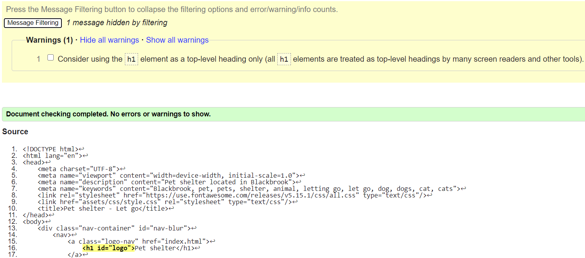

# Testing

View live version of the website [here](https://larkinz.github.io/pet-shelter-project/).

Milestone Project 1: User-Centric Front-end Development – [Code Institute](https://codeinstitute.net/)

In this document you will find information about the testing procedures that I have used to make sure the website displays and functions correctly.

---

## Contents

- [**Browser compatibility**](#browser-compatibility)

  - Tested browsers and devices
  - What I tested
  - Browser compatibility testing results

- [**Mobile responsiveness**](#mobile-responsiveness)

- [**Lighthouse**](#lighthouse)

- [**Code validators**](#code-validators)

  - W3C - Markup Validation Service
  - W3C - CSS Validation Service

- [**Test cases**](#test-cases)

- [**Testing user stories**](#testing-user-stories)

- [**Bugs**](#bugs)

  - Solved bugs
  - Known bugs

---

## Browser compatibility

### Tested browsers and devices

I tested these browser versions on these devices:

**Desktop PC (64-bit, Windows 10):**

- Google Chrome Version 87.0.4280.88 (Official Build) (64-bit)
- Firefox Version 83.0 (64-bit)
- Microsoft Edge Version 87.0.664.55 (Official build) (64-bit)
- Safari (via https://www.browserstack.com/)

**Dell E7240 laptop (64-bit, Windows 10):**

- Internet Explorer Version 11.1139.18362.0 (64-bit)
- Opera Version 72.0.3815.400 (64-bit)

**Samsung Galaxy S7 (Android Version 8.0.0):**

- Samsung internet Version 9.2.00.70
- Brave Browser Version 1.13.87, Chromium 85.0.4183.102

### What I tested

List of things that I tested:

- If things display in the correct order
- If things display in the correct size
- If media displays and works correctly
- If all internal links work
- If hover effects work
- If pop-ups work and display correctly

### Browser compatibility testing results

**Internet Explorer Version 11.1139.18362.0 (64-bit):**

Website is not displaying correctly, everything is out of place and element and text sizing seem completely random. Grid and Flexbox don't seem to be supported either.
The links in the navigation bar work, but other than that I can't test anything since the footer is pretty much invisible. To see some screenshots just click on [example 1](testing-screenshots/IE-homepage.png) and [example 2](testing-screenshots/IE-contact.png).

**Opera Version 72.0.3815.400 (64-bit):**

Everything is working and displaying as intended.

**Safari (via https://www.browserstack.com/):**

I don't have any capability to properly test Safari myself, since I don't own any Apple devices and the Windows version was discontinued in September 2018. After a quick search on the internet I found the
website https://www.browserstack.com/ that lets you test other peoples' devices for a limited amount of time. From my limited testing capabilities what I found was that everything seemed to work and display
correctly on Safari Version 13.1 mac devices ([see screenshot](testing-screenshots/safari-mac.png)). On the one phone that had Safari Version 10 there were some spacing issues between elements ([see screenshot](testing-screenshots/safari-10.png)) and the hamburger
menu seemed to be broken since nothing happened when I tapped it. On all phones I tested that had Safari Version 11 or higher the hamburger menu worked ([see screenshot](testing-screenshots/safari-latest.png)), but the spacing issues between elements
on the homepage was still there. So in conclusion, if you're using the newest version of Safari everything seems okay except for some spacing issues on the homepage.

**Microsoft Edge Version 87.0.664.55 (Official build) (64-bit):**

Everything is working and displaying as intended.

**Firefox Version 83.0 (64-bit):**

Everything is working and displaying as intended.

**Google Chrome Version 87.0.4280.88 (Official Build) (64-bit):**

Everything is working and displaying as intended.

**Samsung Internet Version 9.2.00.70:**

The same spacing issues on the homepage that I encountered when testing Safari on iPhones seem to be present here ([see screenshot](testing-screenshots/SI-homepage.jpg)), other than that everything is working and displaying as intended ([screenshot of footer](testing-screenshots/SI-footer.jpg)).

**Brave Browser Version 1.13.87, Chromium 85.0.4183.102:**

Everything is working and displaying as intended, no spacing issues on the homepage here unlike the other mobile browsers ([see screenshot](testing-screenshots/brave-homepage.jpg)).

**_[Back to top](#contents)_**

---

## Mobile responsiveness

To test the website for mobile responsiveness I've been using the [Google Chrome devtools](testing-screenshots/chrome-devtools.png) throughout the coding of the media queries. I manually used the sliders to go through different screen sizes. I've also used all of the [pre-configured screen sizes](testing-screenshots/devtools-phones.png) in the devtools to test if things looked okay.

**_[Back to top](#contents)_**

---

## Lighthouse

In the Google Chrome devtools is also a [Lighthouse feature](testing-screenshots/google-lighthouse.png) which gives you some performance, accessibility, best practices and SEO indicators for your website. I recorded some before and after scores from several pages. I managed to improve the performance score on pages (although this metric seemed somewhat unreliable, since scores deviated without changes to the website) by putting my images through compression on the https://tinyjpg.com/ website. I also improved accessibility scores by adding an aria-label in the HTML code to the hamburger menu button and on the homepage I added a title to the embedded YouTube video in the HTML code. The SEO score was simply improved by adding meta tags in the HTML with a description of the website and keywords, I did this for all pages. Below you can see some of the before and after scores.

**_[Back to top](#contents)_**

---

## Code validators

### W3C - Markup Validation Service

I've put the HTML code for all pages through the [W3C markup validator](https://validator.w3.org/) and got no errors, just some harmless warnings. On the index.html page I got the following 2 warnings:

The first warning is in regard to the section of the homepage that has the embedded YouTube video in it. I don't want there to be a heading above the video, so I'm just going to argue that this warning can be ignored. The second warning is actually a funny one, it's in regard to using a H1 heading for my site logo. The W3C is actually [using that same method themselves](testing-screenshots/W3C-H1-logo.png) and like [this article](https://wehavezeal.com/blog/web-development/2016/01/12/should-i-use-the-h1-tag-for-my-website-logo) describes, it depends on the size of the website whether that method should be used. When putting the let go, about us and contact pages through the validator I got the same H1 warning that I got for the index.html page:

Weirdly enough I didn't get this warning on the adopt, dog gallery, cat gallery and pet gallery pages, even though I'm using the same code in there:

### W3C - CSS Validation Service

I've put the CSS code from my style.css file through the [W3C CSS validator](https://jigsaw.w3.org/css-validator/) and got no errors:

**_[Back to top](#contents)_**

---

## Test cases

- All pages have a **navigation bar** on the top of the page. Whether you scroll up or down, it stays visible at the top of the page all the time. It has a logo on the left, when you hover it the mouse cursor changes to pointer, when you click on the logo it takes you back to the homepage. On the right side it has multiple navigation links, when you hover either of them the mouse cursor changes to pointer and a line appears under it (except for the contact page link, that one turns a different color when you hover it instead of an underline). When you click one of those links you will be taken to the corresponding page. When you are at the adopt, let go, about or contact page, a permanent underline will be visible under the corresponding link to indicate to the user at what page they are currently at. On smaller screen sizes the navigation links on the right disappear and a hamburger menu icon appears. When you hover the hamburger menu icon the mouse turns into a pointer to indicate to the user that it's clickable. When you click on the hamburger menu icon a dropdown menu appears with all the previously mentioned navigation links. When you hover either of those navigation links the background and text colour inverse and also a mouse pointer is indicating to the user when it's possible to click on either of the links.

- All pages have a **footer** on the bottom of the page. The footer is only visible when the user is at the bottom of the page, so if the page has enough vertical content and the user is scrolled up the footer is not visible. The footer has 3 separate parts. The left part of the footer has a header that says 'address', below it is address information and a phone number, this is all text and not clickable (except for the phone number sometimes, which during testing appeared to be clickable on Apple devices using the Safari browser). The middle part of the footer has a header that says 'pets', below it are internal navigation links to the pet gallery, dog gallery, cat gallery and let go pages. When you hover either of those links the mouse turns into a pointer and the text colour changes to indicate to the user when it's possible to click on either of the links. The right part of the footer has a header that says 'follow us', below it are 3 social media icons (Facebook, Twitter and Instagram). When you hover either of those icons the mouse turns into a pointer and the colour changes to indicate to the user when it's possible to click on either of the icons. When you click either of the icons a **pop-up** appears and the rest of the website is blurred. The pop-up has a header that says 'fictional project' and some text below it that explains to the user that this website is just fictional and therefore there are no actual social media links. On the top right of the pop-up is a cross icon, when you hover it the mouse turns into a pointer and the colour changes to indicate to the user that it's clickable. When you click on it, the pop-up disappears and the site becomes unblurred again so the user can continue browsing. On smaller screen sizes the right part of the footer moves below the left and middle parts to the center of the footer. On even smaller screen sizes all 3 parts of the footer stack in a vertical direction below one another in the center of the footer.

- The main part of the **homepage** is displayed in a 2 by 2 grid of 4 blocks. The top left block has a header that says 'Blackbrook pet shelter', below it is some text with general information regarding the pet shelter. The top right block has an image of a person laying on the floor with a dog while looking it in the eyes. The bottom left block has an image of a person holding a cat. The bottom right block has 2 separate parts. The left part has a header that says 'Adopting a pet', below it is some text with information regarding pet adoption. Inside the text are also 2 internal links to the adoption and contact page, this is indicated by that text having a different colour and also when you hover it the mouse cursor becomes a pointer to indicate to the user that it's clickable. The right part has a header that says 'Letting go of a pet', below it is some text with information regarding letting go of a pet. Inside the text is one internal link to the let go page. That piece of text has a different colour and also when you hover it the mouse cursor becomes a pointer to indicate to the user that it's clickable. Below the main part of the homepage is a section that just consists of an embedded YouTube video that has a title of 'five reasons why to adopt a pet instead of buying'. Hovering the video changes the mouse cursor to a pointer to indicate to the user that the video is clickable. On smaller screen sizes all 4 blocks move below each other in a vertical direction. On even smaller screen sizes the left and right parts from the bottom right block separate and also move under each other and the other content.

- The **adopt page** consists of 3 symmetrical blocks displayed next to each other horizontally, each containing a circular image and a card below it that contains a header and some text. The left block has an image of a dog and below it is a card with a header that says 'Adopt a dog', below that is some text regarding dog adoption. The middle block has an image of a cat and below it is a card with a header that says 'Adopt a cat', below that is some text regarding cat adoption. The right block has an image of a dog and a cat and below it is a card with a header that says 'All pets', below that is some text with general pet adoption information. All cards, when hovered, trigger an animation that moves the card a bit up and to the left. Also when a card is hovered the mouse cursor becomes a pointer to indicate to the user that it's clickable. The left card, when clicked, takes you to the dog gallery page. The middle card, when clicked, takes you to the cat gallery page. The right card, when clicked, takes you to the pet gallery page (the one with all available pets). On smaller screen sizes the right block moves below the left and middle blocks to the center of the page. On even smaller screen sizes all 3 blocks stack in a vertical direction below one another in the center of the page.

- The **dog gallery page** consists of cards that are displayed next to each other horizontally. This page shows the user all dogs that are available for adoption. Each card has an image of a dog, below it is a header that contains the name, age and sex of the corresponding dog. Under the header is a short piece of text that describes the corresponding dog. On smaller screen sizes the cards will be pushed below each other one by one, creating multiple rows of cards. On even smaller screen sizes all cards are displayed vertically below each other.

- The **cat gallery page** consists of cards that are displayed next to each other horizontally. This page shows the user all cats that are available for adoption. Each card has an image of a cat, below it is a header that contains the name, age and sex of the corresponding cat. Under the header is a short piece of text that describes the corresponding cat. On smaller screen sizes the cards will be pushed below each other one by one, creating multiple rows of cards. On even smaller screen sizes all cards are displayed vertically below each other.

- The **pet gallery page** consists of cards that are displayed next to each other horizontally. This page shows the user all pets that are available for adoption. Each card has an image of a pet, below it is a header that contains the name, age and sex of the corresponding pet. Under the header is a short piece of text that describes the corresponding pet. On smaller screen sizes the cards will be pushed below each other one by one, creating multiple rows of cards. On even smaller screen sizes all cards are displayed vertically below each other.

- The **let go page** has a transparent background image and one block element that contains a header that says 'Letting go of your pet'. Below it is some text with information regarding letting go of a pet. Inside the text is one internal link to the contact page. That piece of text has a different colour and also when you hover it the mouse cursor becomes a pointer to indicate to the user that it's clickable. The block element is positioned to the right of the page horizontally to make sure that the most relevant part of the background image is visible to the user. When screen sizes get smaller the block element maintains its distance to the right side of the page, until at some point the element reaches the horizontal center of the page, in which case it stays centered both horizontally and vertically. The header and text content of the element get smaller depending on screen size.

- The **about us page** has a transparent background image and one block element that contains a header that says 'About us'. Below it is some text with information about the origins and culture of the pet shelter. The block element is positioned to the left of the page horizontally to make sure that the most relevant part of the background image is visible to the user. When screen sizes get smaller the block element maintains its distance to the left side of the page, until at some point the element is positioned in the horizontal center of the page, in which case it stays centered both horizontally and vertically. The header and text content of the element get smaller depending on screen size.

- The **contact page** consists of one block element containing a contact form, it has a header that says 'Contact us'. Below it is a text label that says 'Name: (required)', with a corresponding input box underneath that has a placeholder text that says 'Enter your name here...'. Below that is a text label that says 'Email:', with a corresponding input box underneath that has a placeholder text that says 'Enter your email address here...'. Below that is a text label that says 'Phone number: (required)', with a corresponding input box underneath that has a placeholder text that says 'Enter your phone number here...'. Below that is a text label that says 'Reason for inquiry:', with a corresponding dropdown menu underneath that. The dropdown menu presents the user with 4 options: I'd like to adopt a pet, I'd like to let go of a pet, I need additional information, and the last option is: I have a different inquiry. Below that is a text label that says 'Additional information:', with a corresponding textarea that has a placeholder text that says 'Provide us with any additional information here'. Underneath the textarea is a button that says 'Submit', when the user clicks that button after filling in the required things in the form nothing happens (except for some of the filled in information that appears in the browser URL box) because this project has no back-end. Normally the information from the form would be sent to a server, but this project is font-end only. If the user doesn't fill in the required information and clicks the submit button, then a warning will pop-up, telling the user to 'please fill out this field' or 'please include an @ in the email address'. On smaller screen sizes the block element and all its content get smaller to maintain readability.

**_[Back to top](#contents)_**

---

## Testing user stories

- As a visitor, I would like to see an overview of all pets that are available for adoption, so that I don't have to travel there to find out if there is anything available that I'm looking for.

1. The visitor enters the homepage where he or she can immediately find a link to the adopt page in the navigation bar. On top of that there is also a clearly visible header that says 'Adopting a pet' where in the corresponding text below he or she will find another link to the adopt page. As a bonus option the visitor can even go straight to the page that shows all pets available for adoption by clicking on the 'Gallery' link in the middle part of the footer.
2. Arriving at the adopt page the visitor is greeted by 3 cards that have obvious headers with corresponding images above. The visitor sees the 'All pets' header and in the text below it clearly states 'to have a look at all available pets just click anywhere on this card'.
3. After clicking on the card in the adopt page or clicking on the 'gallery' link from the homepage, the visitor has arrived at the pet gallery. Here he or she is presented with a clear overview of all the pets that are available for adoption.

---

- As a visitor, I would like to see images of all pets that are available for adoption, so that I can decide if it's worth visiting the shelter.

1. The visitor enters the homepage where he or she can find a 'gallery' link in the footer, indicating that there are images to been seen.
2. After clicking on the 'gallery' link, the visitor is taken to the pet gallery page where he or she is greeted by an overview of pet cards that all have images of the available pets.

---

- As a visitor, I would like an easy to fill in contact form, so that I can contact the pet shelter to get answers to any questions that I have.

1. The visitor enters the homepage where he or she can immediately find a clearly by colour defined link to the contact page in the navigation bar. On top of that there is also a link in the text below the 'Adopting a pet' header.
2. Arriving at the contact page the visitor is presented with a simple contact form that has obvious labels and placeholder text that instructs the visitor what to fill in where. The labels also indicate to the visitor which of the information is a requirement. On top of that there is a dropdown menu where the visitor can easily choose his or her reason for inquiry without having to type that somewhere.

---

- As a visitor, I would like to know the pet shelters' address information, so that I know where to travel to.

1. On every single page the visitor can find the address information clearly provided on the left part of the footer.

---

- As a visitor, I would like clear and concise information about letting go of a pet, so that I can get a good understanding of what the process is like.

1. The visitor enters the homepage where he or she can immediately find a link to the let go page in the navigation bar. On top of that there is also a clearly visible header that says 'Letting go of a pet' where in the corresponding text below he or she will find another link to the let go page. As a bonus option the visitor can even go straight to the let go page by clicking on the 'Let go of a pet' link in the middle part of the footer.
2. Arriving at the let go page the visitor is greeted by a piece of text that contains the information and instructions that he or she was looking for.

---

- As a site owner, I would like our website to have an intuitive navigation system, so that visitors can easily access all available information.

1. On the top of every page is an obvious navigation bar that is visible at all times, even when the visitor scrolls up or down. On both the homepage and the navigation bar there are direct links to all sorts of information that a visitor could be looking for. As a bonus there is also some information provided in the footer, which is visible at the bottom of every single page. The footer also contains extra links that provides visitors with even more ease of access.

---

- As a site owner, I would like our website to have a contact form where clients can specify their needs, so that we prevent unnecessary customer support calls.

1. In the contact form the visitor is required to provide their phone number, which allows for faster and more direct communication than via email. On top of that the visitors' reasons for inquiry are narrowed down to only 4 choices, providing the site owner with a lower chance of receiving ambiguous information.

**_[Back to top](#contents)_**

---

## Bugs

### Solved bugs

- When I tried (through trial & error) creating a transparent background image for the let go and about us pages, the main content kept getting transparent as well. I ended up having to use [this code snippet](https://css-tricks.com/snippets/css/transparent-background-images/) from https://css-tricks.com/ to get it working as intended.

- To create a pop-up modal for my social media icons in the footer I tried to follow several different YouTube videos. I ended up liking [this solution](https://www.youtube.com/watch?v=snhpoxtLugU) by YouTube channel 'Online Tutorials', but of course I had to modify it to suit my website. That was pretty tricky, because I haven't learned JavaScript yet, and most of the important code involved in the solution consisted of JavaScript. What ended up happening first is that blurring the website also caused the pop-up to be blurred. Then I managed the pop-up to be readable, but I couldn't get either the footer or parts of the main page to be blurred at the same time. The solution I ended up figuring out was to create separate variables for all the parts of the website that needed to be blurred, so I gave them all ID's (nav-blur, main-blur, section-blur, footer-blur) linked to the variables.

- When the right part of the footer got pushed down by flexbox wrap, I couldn't get it to horizontally center properly. I first used either margin or padding with 33% to get it done, but then found out that it wasn't centered on different screen sizes. Ended up deleting all of the footer media queries 1 or 2 days later and start from scratch. The first solution I came up with worked immediately, which was to give the right part of the footer a width of 100% and text align center.

- My mentor pointed out that in Google Chrome devtools the console gave several errors on the homepage ([see screenshot](testing-screenshots/console-errors.png)). They were coming from the embedded YouTube video. We ended up fixing it by changing the no-cookie YouTube link to a regular YouTube link and removing some attributes.

- For some phone screen sizes in landscape mode everything looked kind of zoomed in or sub-optimal ([see screenshot](testing-screenshots/landscape-issue.png)), especially on the let go and about us pages, while on other phone screen sizes it looked perfectly fine. My mentor reminded me of the option to target landscape mode specifically in the media queries, so I went through the whole website and improved all pages mobile responsiveness.

### Known bugs

- During testing it appeared that the hamburger menu button didn't work on iPhones using Safari 10.0 or older.

- When using Samsung Internet on an Android phone or Safari on an iPhone there are some spacing issues between several elements of the homepage ([see screenshot](testing-screenshots/SI-homepage.jpg)).

- The website seems to be completely broken when using Internet Explorer. (see [example 1](testing-screenshots/IE-homepage.png) and [example 2](testing-screenshots/IE-contact.png))

**_[Back to top](#contents)_**

---
